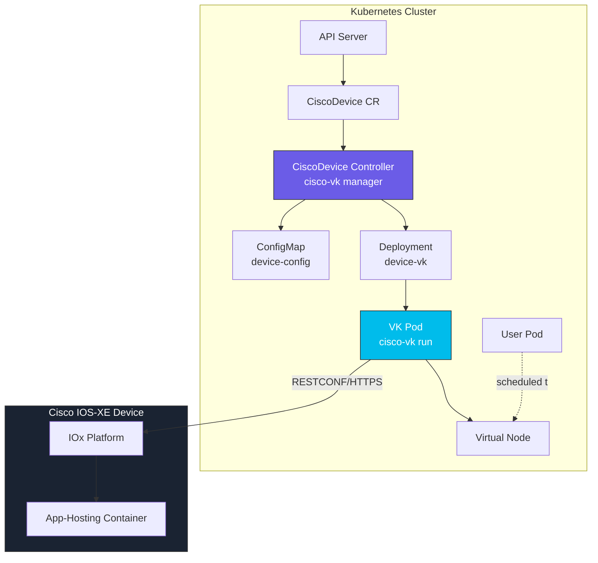
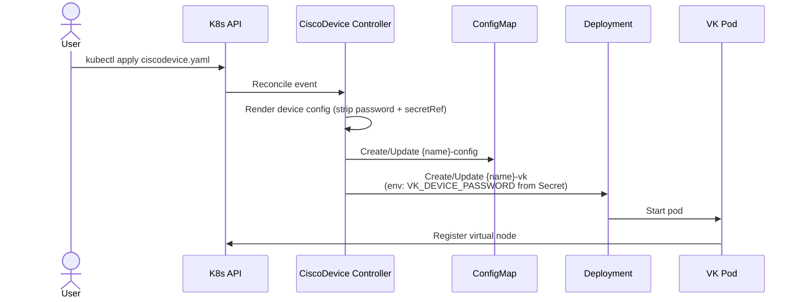
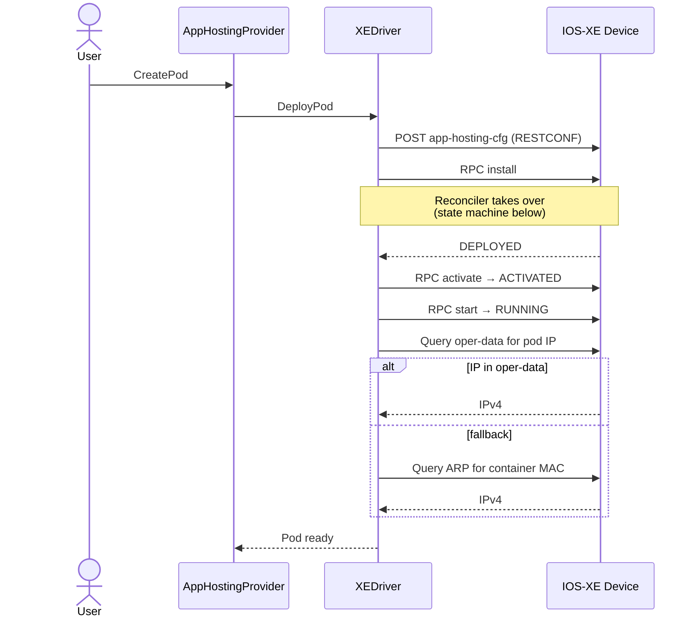
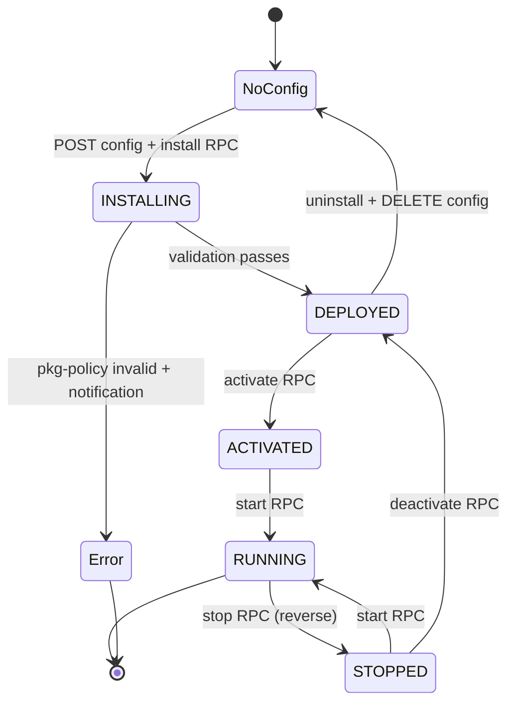

# Architecture

This document describes the technical architecture of Cisco Virtual Kubelet.

## Overview

Cisco Virtual Kubelet implements the [Virtual Kubelet](https://github.com/virtual-kubelet/virtual-kubelet) provider interface so Kubernetes can treat Cisco IOS-XE devices as compute nodes. Each device appears as a node in the cluster; pods scheduled to that node are deployed as IOx App-Hosting containers on the device over RESTCONF.

### The two-binary split

Everything the project does comes out of a single `cisco-vk` CLI with two subcommands:

- **`cisco-vk manager`** — the Kubernetes controller. Watches `CiscoDevice` custom resources and, for each one, creates a ConfigMap + Deployment. It knows nothing about individual devices; it just reconciles CR state into Kubernetes resources.
- **`cisco-vk run`** — the Virtual Kubelet provider. One process per device. Reads its config, registers a virtual node in the cluster, and drives the device via RESTCONF when pods come and go.

This split keeps device credentials and per-device logic out of the controller. The controller holds minimal cluster-level RBAC; each VK pod holds only the credentials for its one device.

## Component architecture



## Core components

### AppHostingProvider

Implements the Virtual Kubelet `nodeutil.Provider` interface — the main entry point for pod operations.

| Method | Purpose |
|---|---|
| `CreatePod(ctx, pod)` | Delegates to `driver.DeployPod`, then forces a node status update |
| `UpdatePod(ctx, pod)` | Guards against no-op churn; if the app already exists, does nothing |
| `DeletePod(ctx, pod)` | Delegates to `driver.DeletePod` then forces a node status update |
| `GetPod(ctx, ns, name)` | Fast path: informer cache. Fallback: device query for cleanup |
| `GetPodStatus(ctx, ns, name)` | Queries live pod status from the device |
| `GetPods(ctx)` | Lists all managed pods discovered on the device |
| `GetStatsSummary(ctx)` | Returns Kubernetes stats/summary data (see [Observability](observability.md)) |
| `GetMetricsResource(ctx)` | Returns Prometheus metrics (see [Observability](observability.md)) |

Operations that don't make sense for app-hosting — `RunInContainer`, `AttachToContainer`, `GetContainerLogs`, `PortForward` — return HTTP 501.

### AppHostingNode

Implements `node.NodeProvider` for node registration, heartbeat, and status.

- `Ping()` — throttled to a 30-second minimum; triggers `syncNodeStatus` asynchronously
- `NotifyNodeStatus(cb)` — fires the callback whenever node status changes (labels, annotations, capacity, conditions)
- `ForceStatusUpdate()` — called after every pod lifecycle event so resource accounting stays fresh

The node's `Labels` include standard topology (`topology.kubernetes.io/zone=cisco-iosxe`, `region=cisco-iosxe`) plus `type=virtual-kubelet`. Node **annotations** are populated dynamically on every status sync from the driver's `TopologyProvider` data — see [Observability → Node annotations](observability.md#node-annotations).

Conditions published:

- `Ready` — true when IOx is enabled on the device
- `DiskPressure` — true when device storage < 5% available

### Driver factory

```go
func NewDriver(ctx, spec) (CiscoKubernetesDeviceDriver, error)
```

Selects a driver based on `spec.Driver`:

- `XE` → IOS-XE driver (production)
- `FAKE` → mock driver for testing
- `XR`, `NXOS` → placeholders, currently unsupported

### Driver interfaces

Every driver must implement `CiscoKubernetesDeviceDriver`:

```go
type CiscoKubernetesDeviceDriver interface {
    GetDeviceResources(ctx) (*v1.ResourceList, error)
    GetDeviceInfo(ctx) (*common.DeviceInfo, error)
    DeployPod(ctx, pod)
    UpdatePod(ctx, pod)
    DeletePod(ctx, pod)
    GetPodStatus(ctx, pod) (*v1.Pod, error)
    ListPods(ctx) ([]*v1.Pod, error)
    GetGlobalOperationalData(ctx) (*common.AppHostingOperData, error)
}
```

Drivers may additionally implement the **optional** `TopologyProvider` interface — this is what enables OTEL topology export, the `cisco_device_cdp_*`/`ospf_*`/`interface_*` metrics, and the `cisco.io/*` node annotations.

```go
type TopologyProvider interface {
    GetCDPNeighbors(ctx) ([]common.CDPNeighbor, error)
    GetOSPFNeighbors(ctx) ([]common.OSPFNeighbor, error)
    GetInterfaceStats(ctx) ([]common.InterfaceStats, error)
    GetInterfaceIPs(ctx) ([]common.InterfaceIP, error)
    GetHostedApps(ctx) ([]common.HostedApp, error)
}
```

The IOS-XE driver implements it. Drivers without topology support still work — their VKs just skip the optional metrics/traces/annotations.

### IOS-XE driver — internal layering

`internal/drivers/iosxe/` is organised by responsibility. Each layer is independently testable.

| File | Responsibility |
|---|---|
| `driver.go` | Driver construction, marshallers, config hooks |
| `device.go` | Device-level queries (connectivity, resources, device info) |
| `client.go` | Transport abstraction — currently RESTCONF, designed to accommodate NETCONF later |
| `reconciler.go` | App lifecycle state machine (see below) |
| `pod_lifecycle.go` | `DeployPod` / `DeletePod` / `GetPodStatus` / `ListPods` |
| `pod_transforms.go` | Pod.Spec → IOS-XE `AppHostingConfig` |
| `status_transforms.go` | Device oper-data → Pod.Status |
| `ip_discovery.go` | Pod IP discovery (oper-data first, ARP table fallback) |
| `topology.go` | `TopologyProvider` implementation — CDP, OSPF, interfaces |
| `models.go` | YANG structs, auto-generated via [ygot](https://github.com/openconfig/ygot) |

## Data flow

### Controller reconciliation



The controller **never persists credentials**. `password` and `credentialSecretRef` are both stripped from the `DeviceSpec` before it is marshalled into the ConfigMap. Credentials reach the VK pod via a `valueFrom.secretKeyRef` env var injected into the Deployment spec. See [Security](security.md).

### Pod creation flow



### Pod deletion flow

Reverse of creation: `RUNNING → stop → ACTIVATED → deactivate → DEPLOYED → uninstall → config DELETE`. If a state is skipped (e.g. app already stopped), the reconciler picks up from wherever the observed state actually is.

## App lifecycle state machine

The IOS-XE driver's reconciler (`reconciler.go`) drives each app toward its desired state by observing live state and issuing a single RPC per pass.



**Key behaviours:**

- **`INSTALLING`** — normally transient. The reconciler waits unless `pkg-policy = iox-pkg-policy-invalid` **and** a confirming install notification has been received from the device. During the first few seconds of every install the device reports `pkg-policy = invalid` as a YANG default; waiting for the notification prevents this transient value from being treated as a fatal error. If `spec.allowUnsignedApps = true`, the check is skipped entirely — use this when you're running unsigned packages (e.g. your own custom application builds, or devices not enforcing signed-verification).
- **`STOPPED`** — restartable directly via `start` (no re-activate needed).
- **No oper data** with config present — reconciler re-issues the install RPC.
- **Error** — surfaces as Pod `Failed` with reason `PackagePolicyInvalid` and a message from the device's notification.

### Reverse path (desired = Deleted)

| Observed state | Action |
|---|---|
| `RUNNING` | `stop` |
| `ACTIVATED` or `STOPPED` | `deactivate` |
| `DEPLOYED` | `uninstall` |
| No oper data | `DELETE` config |

## Pod status and discovery

### Pod-to-app naming

App IDs follow `cvk{index}_{podUID}` where the UID has hyphens stripped. Up to 10 containers per pod (index `0-9`). Example: `cvk00000_a1b2c3d4e5f6a1b2c3d4e5f6a1b2c3d4`.

This lets the driver rebuild pod identity when listing apps from the device — the UID is embedded in the app ID, and pod metadata (name, namespace, container name) is stored as key-value labels in the app's `--run-opts`:

```
io.kubernetes.pod.name=<name>
io.kubernetes.pod.namespace=<namespace>
io.kubernetes.pod.uid=<uid>
io.kubernetes.container.name=<container>
```

### Container state mapping

| IOS-XE state | Container state | Ready |
|---|---|---|
| `RUNNING` | Running | `true` |
| `DEPLOYED`, `ACTIVATED`, `INSTALLING` | Pending | `false` |
| `STOPPED` | Terminated (exit 0) | `false` |
| Error / `pkg-policy-invalid` confirmed | Terminated with exit code + reason | `false` |

### IP discovery

1. Query app-hosting oper-data for `ipv4-addr`
2. Fallback: ARP table lookup by the container's MAC address
3. Default: `0.0.0.0` (no IP yet)

## Pod recovery loop

A background goroutine in `cisco-vk run` periodically lists all pods on this node in `Failed` phase and resets them to `Pending` if their `status.Reason` is one of:

- `NotFound`
- `ProviderFailed`
- `PackagePolicyInvalid`

This lets the VK controller reprocess the pod without manual `kubectl delete/apply`. The recovery loop uses exponential backoff: **15 s → 30 s → 60 s → 120 s → 240 s → 300 s** (5 min cap). On any successful recovery the interval resets to 15 s.

Pods with a `DeletionTimestamp` are skipped — the normal deletion path owns those.

## Networking

Three interface modes are supported (see [Configuration](CONFIGURATION.md#xeconfig-ios-xe-networking) for field reference, and the platform-specific pages [Catalyst 8000V](configuration-cat8000v.md) / [Catalyst 9000](configuration-cat9000.md) for device-side setup):

| Mode | IP source | Use case |
|---|---|---|
| **VirtualPortGroup** | DHCP pool on VPG or static from `podCIDR` | Catalyst 8000V; containers share a private L3 to the device |
| **AppGigabitEthernet** | DHCP (access) or DHCP in VLAN (trunk) | Catalyst 9000; containers on a dedicated front-panel interface with optional VLAN tagging |
| **Management** | DHCP or static on the management interface | Containers sharing the device management network |

### DHCP flow (VirtualPortGroup example)

```
┌────────────┐    ┌──────────────────┐    ┌──────────────────┐
│ Container  │───▶│ VirtualPortGroup0│───▶│   DHCP Pool      │
│ (eth0)     │    │  gateway .254    │    │   /24 subnet     │
│            │◀───│                  │◀───│   assigns IP     │
└────────────┘    └──────────────────┘    └──────────────────┘
```

Provider-side IP discovery always happens **after** deploy completes — it polls oper-data first, then falls back to ARP, then retries on the next reconcile.

## Observability

See [Observability](observability.md) for the full reference. At a high level:

- **Prometheus metrics** are served on the standard kubelet `/metrics/resource` endpoint and cover device CPU, memory, storage, per-interface rates/state, and CDP/OSPF neighbor counts.
- **Kubernetes stats/summary** is served on `/stats/summary`, enabling `kubectl top node`.
- **OpenTelemetry topology traces** are emitted on a configurable interval (default 60 s) and include a device root span with child link spans (one per CDP/OSPF neighbor) and app spans (one per hosted container).
- **Node annotations** (`cisco.io/router-id`, `cisco.io/hostname`, `cisco.io/cdp-neighbor-count`, `cisco.io/ospf-neighbor-count`, `cisco.io/protocols`) make topology context queryable via `kubectl describe node`.

## RESTCONF endpoints

| Operation | Method | Endpoint |
|-----------|--------|----------|
| App config (create/list) | POST/GET | `/restconf/data/Cisco-IOS-XE-app-hosting-cfg:app-hosting-cfg-data/apps` |
| App config (delete) | DELETE | `/restconf/data/Cisco-IOS-XE-app-hosting-cfg:app-hosting-cfg-data/apps/app={id}` |
| App oper-data | GET | `/restconf/data/Cisco-IOS-XE-app-hosting-oper:app-hosting-oper-data/app` |
| Lifecycle RPCs (install/activate/start/stop/deactivate/uninstall) | POST | `/restconf/operations/Cisco-IOS-XE-app-hosting-rpcs:app-*` |
| Device version | GET | `/restconf/data/Cisco-IOS-XE-native:native/version` |
| CDP neighbors | GET | `/restconf/data/Cisco-IOS-XE-cdp-oper:cdp-neighbor-details` |
| OSPF neighbors | GET | `/restconf/data/Cisco-IOS-XE-ospf-oper:ospf-oper-data` |
| Interfaces | GET | `/restconf/data/ietf-interfaces:interfaces` |
| ARP table | GET | `/restconf/data/Cisco-IOS-XE-arp-oper:arp-data` |

### YANG models

- `Cisco-IOS-XE-app-hosting-cfg` — app config
- `Cisco-IOS-XE-app-hosting-oper` — app runtime state
- `Cisco-IOS-XE-app-hosting-rpcs` — lifecycle RPCs
- `Cisco-IOS-XE-cdp-oper` — CDP neighbor discovery
- `Cisco-IOS-XE-ospf-oper` — OSPF neighbor state
- `Cisco-IOS-XE-arp-oper` — ARP-based IP discovery

## Project layout

```
cisco-virtual-kubelet/
├── api/v1alpha1/              # CRD-ready API types (DeviceSpec, XEConfig, OTELConfig)
├── cmd/cisco-vk/              # Unified binary
│   ├── main.go                # cobra root
│   ├── run.go                 # 'run' subcommand — the VK provider
│   └── manager.go             # 'manager' subcommand — the controller
├── charts/cisco-virtual-kubelet/  # Helm chart (controller + RBAC + CRDs)
├── config/crd/                # Generated CRD manifests
├── internal/
│   ├── config/                # YAML/viper loader
│   ├── controller/            # CiscoDevice reconciler
│   ├── provider/              # AppHostingProvider, metrics, OTEL topology
│   └── drivers/               # Driver implementations
│       ├── common/            # Shared types (DeviceInfo, CDPNeighbor, etc.)
│       ├── iosxe/             # IOS-XE driver (see layering table above)
│       └── fake/              # Mock driver for tests
├── examples/                  # Example device configs and pod manifests
└── docs/                      # This documentation
```
