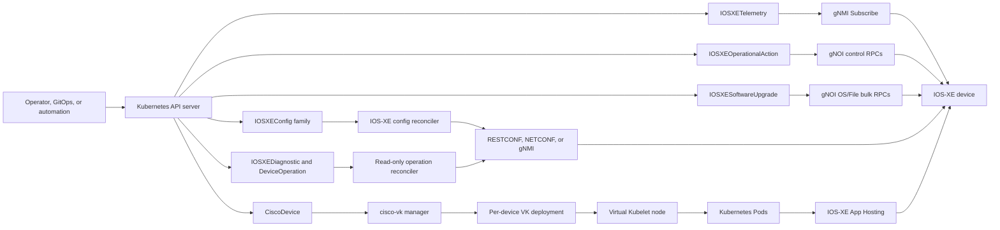
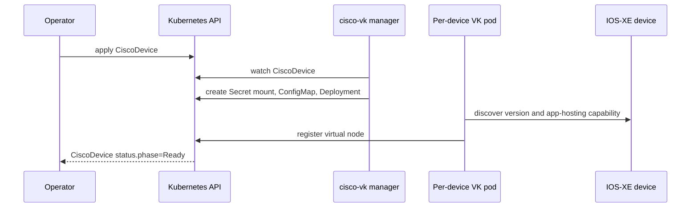
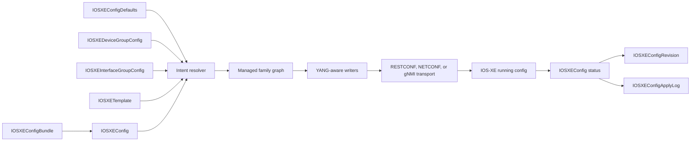
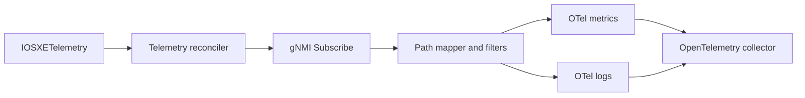
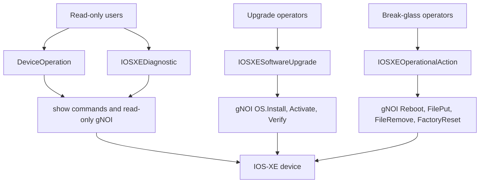
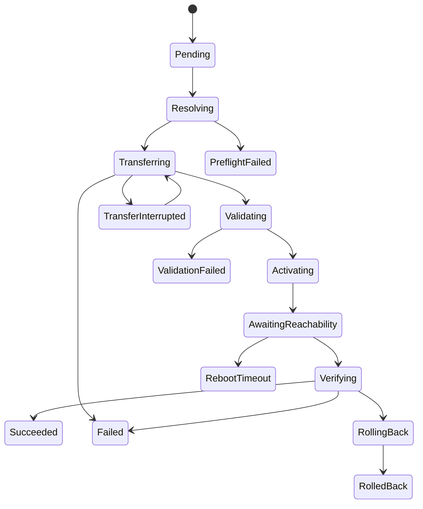

# CRD Reference

Cisco Virtual Kubelet is operated primarily through Kubernetes Custom
Resources. This page is the operator-facing map for the CRDs shipped by the
chart: what each CRD is for, which controller owns it, and what a normal usage
flow looks like from `kubectl`.

## API Surface Map



## CRDs At A Glance

```bash
$ kubectl api-resources | grep -E 'cisco|iosxe|deviceoperations'
NAME                         SHORTNAMES      APIVERSION                  NAMESPACED   KIND
ciscodevices                 cvk             cisco.vk/v1alpha1          true         CiscoDevice
iosxeconfigs                 iosxecfg        config.cisco.vk/v1alpha1   true         IOSXEConfig
iosxeconfigdefaults          iosxedefaults   config.cisco.vk/v1alpha1   false        IOSXEConfigDefaults
iosxedevicegroupconfigs      iosxegroup      config.cisco.vk/v1alpha1   true         IOSXEDeviceGroupConfig
iosxeinterfacegroupconfigs   iosxeifgroup    config.cisco.vk/v1alpha1   true         IOSXEInterfaceGroupConfig
iosxetemplates               iosxetpl        config.cisco.vk/v1alpha1   true         IOSXETemplate
iosxeconfigbundles           iosxebundle     config.cisco.vk/v1alpha1   true         IOSXEConfigBundle
iosxeconfigrevisions         iosxerev        config.cisco.vk/v1alpha1   true         IOSXEConfigRevision
iosxeconfigapplylogs         iosxelog        config.cisco.vk/v1alpha1   true         IOSXEConfigApplyLog
iosxediagnostics             iosxediag       config.cisco.vk/v1alpha1   true         IOSXEDiagnostic
iosxetelemetries             iosxetel        config.cisco.vk/v1alpha1   true         IOSXETelemetry
deviceoperations             devop           ops.cisco.vk/v1alpha1      true         DeviceOperation
iosxeoperationalactions      xeop            ops.cisco.vk/v1alpha1      true         IOSXEOperationalAction
iosxesoftwareupgrades        xeupgrade       ops.cisco.vk/v1alpha1      true         IOSXESoftwareUpgrade
```

| Kind | Scope | Primary use |
|---|---:|---|
| `CiscoDevice` | Namespaced | Declares one managed IOS-XE device and drives the per-device VK pod. |
| `IOSXEConfigDefaults` | Cluster | Fleet-wide baseline configuration merged into device intent. |
| `IOSXEDeviceGroupConfig` | Namespaced | Shared configuration for selected devices. |
| `IOSXEInterfaceGroupConfig` | Namespaced | Shared configuration for selected interfaces on selected devices. |
| `IOSXETemplate` | Namespaced | Reusable parameterized configuration fragments. |
| `IOSXEConfig` | Namespaced | Per-device Network as Code intent, drift detection, apply, and rollback. |
| `IOSXEConfigBundle` | Namespaced | Fans one IOSXEConfig template out across selected devices. |
| `IOSXEConfigRevision` | Namespaced | Immutable resolved-intent history used for rollback and audit. |
| `IOSXEConfigApplyLog` | Namespaced | Optional per-apply audit entries with family and diff metadata. |
| `IOSXEDiagnostic` | Namespaced | Read-only command capture, one-shot or scheduled. |
| `IOSXETelemetry` | Namespaced | gNMI MDT subscriptions mapped to OpenTelemetry signals. |
| `DeviceOperation` | Namespaced | Auditable read-only operational requests, including gNOI probes. |
| `IOSXEOperationalAction` | Namespaced | One-shot write-class gNOI actions with confirmation and events. |
| `IOSXESoftwareUpgrade` | Namespaced | Multi-phase gNOI software install, activate, verify, and rollback. |

## CiscoDevice

`CiscoDevice` is the inventory and lifecycle root. The manager watches it,
creates or updates a per-device VK deployment, and that VK registers a virtual
node that can host Kubernetes pods through IOS-XE App Hosting.



Use it when you want Kubernetes to see a Cisco device as a schedulable node.
Important fields are `spec.driver`, `spec.address`, `spec.credentialSecretRef`,
`spec.transport`, `spec.configPrereqs`, and `spec.opsPolicy`.

```yaml
apiVersion: cisco.vk/v1alpha1
kind: CiscoDevice
metadata:
  name: cat9300-4
  labels:
    site: lab
    role: access
spec:
  driver: XE
  address: 198.51.100.104
  port: 443
  username: cisco
  credentialSecretRef:
    name: cat9300-4-credentials
  transport: restconf
  maxPods: 16
  xe:
    networking:
      interface:
        type: AppGigabitEthernet
        appGigabitEthernet:
          mode: trunk
          vlanIf:
            dhcp: true
            vlan: 300
            guestInterface: 0
```

```bash
$ kubectl get cvk
NAME        DRIVER   ADDRESS          PHASE   AGE
cat9300-4   XE       198.51.100.104   Ready   42m

$ kubectl get nodes -l cisco.io/device=cat9300-4
NAME        STATUS   ROLES   AGE   VERSION
cat9300-4   Ready    agent   41m   v1.30.0-vk
```

## Network As Code Flow

The configuration CRDs work together. Defaults, groups, interface groups,
templates, and per-device source are resolved into one canonical intent. The
config driver plans the change, applies managed families, verifies drift, and
records history.



### IOSXEConfigDefaults

`IOSXEConfigDefaults` is cluster-scoped baseline intent. Use it for fleet-wide
configuration that should apply before namespace or device-specific overrides.

```yaml
apiVersion: config.cisco.vk/v1alpha1
kind: IOSXEConfigDefaults
metadata:
  name: enterprise-baseline
spec:
  configuration:
    ntp:
      servers:
        - address: 192.0.2.10
    aaa:
      new_model: true
```

```bash
$ kubectl get iosxedefaults
NAME                  AFFECTED   AGE
enterprise-baseline   18         2d
```

### IOSXEDeviceGroupConfig

`IOSXEDeviceGroupConfig` selects devices by explicit references or labels and
contributes shared intent. Use it for site, role, or platform configuration.

```yaml
apiVersion: config.cisco.vk/v1alpha1
kind: IOSXEDeviceGroupConfig
metadata:
  name: lab-access
spec:
  deviceSelector:
    matchLabels:
      site: lab
      role: access
  configuration:
    logging:
      hosts:
        - 192.0.2.30
```

```bash
$ kubectl get iosxegroup
NAME         MEMBERS   AGE
lab-access   4         1h
```

### IOSXEInterfaceGroupConfig

`IOSXEInterfaceGroupConfig` applies shared intent to matching interfaces on
matching devices. Use it for repeated switchport, VLAN, trunk, or management
patterns.

```yaml
apiVersion: config.cisco.vk/v1alpha1
kind: IOSXEInterfaceGroupConfig
metadata:
  name: app-hosting-uplinks
spec:
  deviceSelector:
    matchLabels:
      role: access
  interfaceSelector:
    - type: GigabitEthernet
      namePattern: "1/0/[1-4]"
  configuration:
    interface_ethernet:
      interfaces:
        - description: "Kubernetes app-hosting access"
          enabled: true
```

```bash
$ kubectl get iosxeifgroup
NAME                  MEMBERS   AGE
app-hosting-uplinks   16        52m
```

### IOSXETemplate

`IOSXETemplate` stores reusable fragments. Templates keep common intent in one
place and let `IOSXEConfig` inject values from the target device or namespace.

```yaml
apiVersion: config.cisco.vk/v1alpha1
kind: IOSXETemplate
metadata:
  name: snmp-site-template
spec:
  parameters:
    - name: site
      type: string
      required: true
  configuration:
    snmp_server:
      location: "{{ .site }}"
```

```bash
$ kubectl get iosxetpl
NAME                 REFS   AGE
snmp-site-template   6      3h
```

### IOSXEConfig

`IOSXEConfig` is the main per-device declarative configuration CRD. Use it for
managed YANG families, drift detection, dry-run style planning, transaction
mode, source version selection, and rollback.

```yaml
apiVersion: config.cisco.vk/v1alpha1
kind: IOSXEConfig
metadata:
  name: cat9300-4-network
spec:
  deviceRef:
    name: cat9300-4
  managedFamilies:
    - dhcp
    - vlan
  driftPolicy: report
  writeStartup: true
  source:
    inline:
      vlan:
        vlans:
          - id: 300
            name: APP_HOSTING
      dhcp:
        pools:
          - name: app-hosting
            network: 10.30.0.0
            mask: 255.255.255.0
            default_router: 10.30.0.1
```

```bash
$ kubectl get iosxecfg
NAME                 DEVICE      PHASE    DRIFT    AGE
cat9300-4-network    cat9300-4   InSync   none     17m

$ kubectl describe iosxecfg cat9300-4-network | sed -n '/Status:/,/Events:/p'
Status:
  Phase:               InSync
  Source Yang Version: 17.18
  Last Applied Hash:   sha256:8ac9...
  Family Status:
    interfaces: InSync
    dhcp:       InSync
    vlan:       InSync
```

### IOSXEConfigBundle

`IOSXEConfigBundle` fans one `IOSXEConfig` template out across devices. Use it
when the same config should be stamped across a selected fleet while still
keeping one generated per-device `IOSXEConfig` for status and rollback.

```yaml
apiVersion: config.cisco.vk/v1alpha1
kind: IOSXEConfigBundle
metadata:
  name: lab-vlan-300
spec:
  deviceSelector:
    matchLabels:
      site: lab
  template:
    managedFamilies: ["vlan"]
    source:
      inline:
        vlan:
          vlans:
            - id: 300
              name: APP_HOSTING
```

```bash
$ kubectl get iosxebundle
NAME           DEVICES   AGE
lab-vlan-300   4         13m

$ kubectl get iosxecfg -l config.cisco.vk/bundle=lab-vlan-300
NAME                      DEVICE      PHASE    DRIFT   AGE
lab-vlan-300-cat9300-4    cat9300-4   InSync   none    13m
lab-vlan-300-cat9300-5    cat9300-5   InSync   none    13m
```

### IOSXEConfigRevision

`IOSXEConfigRevision` is the resolved-intent history for an `IOSXEConfig`.
Operators normally read it for audit or reference it from `spec.rollbackTo`.

```bash
$ kubectl get iosxerev
NAME                          DEVICE      SOURCE             GENERATION   AGE
cat9300-4-network-r000004     cat9300-4   cat9300-4-network  4            18m
cat9300-4-network-r000005     cat9300-4   cat9300-4-network  5            8m
```

```yaml
apiVersion: config.cisco.vk/v1alpha1
kind: IOSXEConfig
metadata:
  name: cat9300-4-network
spec:
  rollbackTo: cat9300-4-network-r000004
```

### IOSXEConfigApplyLog

`IOSXEConfigApplyLog` is an audit artifact for apply attempts. Use it when you
need retained evidence of the phase, family outcomes, diff summary, or apply
errors without expanding the main `IOSXEConfig` status.

```bash
$ kubectl get iosxelog
NAME                       DEVICE      ENTRIES   TRUNCATED   AGE
cat9300-4-network-log      cat9300-4   12        false       2h

$ kubectl get iosxelog cat9300-4-network-log -o jsonpath='{.status.entries[-1].phase}'
InSync
```

### IOSXEDiagnostic

`IOSXEDiagnostic` runs read-only IOS-XE commands. It can run once, on a schedule,
or inside a maintenance window. Output can remain inline or spill to
ConfigMaps for large captures.

```yaml
apiVersion: config.cisco.vk/v1alpha1
kind: IOSXEDiagnostic
metadata:
  name: cat9300-4-show-tech-lite
spec:
  deviceRef:
    name: cat9300-4
  commands:
    - show version
    - show ip interface brief
  retention:
    maxResults: 10
    truncateAt: 64KiB
```

```bash
$ kubectl get iosxediag
NAME                       DEVICE      COMMANDS   PHASE       SCHEDULE   NEXT   LAST   AGE
cat9300-4-show-tech-lite   cat9300-4   2          Completed                         4m
```

### IOSXETelemetry

`IOSXETelemetry` declares gNMI Subscribe streams and maps notifications into
OpenTelemetry metrics and logs. Use it for streaming MDT from a device through
the per-device VK.



```yaml
apiVersion: config.cisco.vk/v1alpha1
kind: IOSXETelemetry
metadata:
  name: cat9300-4-interfaces
spec:
  deviceRef:
    name: cat9300-4
  subscriptions:
    - name: interface-counters
      mode: STREAM
      streamMode: SAMPLE
      sampleInterval: 30s
      paths:
        - /interfaces/interface/state/counters
  output:
    signal: ["metrics"]
```

```bash
$ kubectl get iosxetel
NAME                    DEVICE      PHASE       AGE
cat9300-4-interfaces    cat9300-4   Streaming   9m
```

## Operation CRDs

Operation CRDs are separated by trust level. `DeviceOperation` and
`IOSXEDiagnostic` are read-only. `IOSXEOperationalAction` and
`IOSXESoftwareUpgrade` require explicit runtime enablement and should receive
separate RBAC grants.



### DeviceOperation

`DeviceOperation` is the auditable asynchronous path for read-only operations.
Supported kinds are `ShowCommand`, `ConfigDiff`, `PacketCapture`, `GNOIPing`,
`GNOITraceroute`, `GNOITime`, `GNOIFileGet`, `GNOIFileStat`, `GNOICertGet`,
`GNOICanGenerateCSR`, `GNOIRebootStatus`, and `GNOIOSVerify`.

```yaml
apiVersion: ops.cisco.vk/v1alpha1
kind: DeviceOperation
metadata:
  name: cat9300-4-gnoi-time
spec:
  deviceRef:
    name: cat9300-4
  operation:
    kind: GNOITime
  ttlSecondsAfterFinished: 600
```

```bash
$ kubectl get devop
NAME                   DEVICE      KIND       PHASE       AGE
cat9300-4-gnoi-time    cat9300-4   GNOITime   Succeeded   24s

$ kubectl get devop cat9300-4-gnoi-time -o jsonpath='{.status.outputs[0].output}'
2026-05-18T14:23:09Z
```

### IOSXEOperationalAction

`IOSXEOperationalAction` is for write-class one-shot gNOI actions. It supports
`Reboot`, `CancelReboot`, `KillProcess`, `FilePut`, `FileRemove`, and
`FactoryReset`. The per-device VK must be started with
`--enable-write-class-gnoi` or `CISCO_VK_ENABLE_WRITE_CLASS_GNOI=true`.

Every action requires `spec.confirm` to equal the target device name, the spec
is immutable after creation, and a `Running` action is not dispatched a second
time after controller restart.

```yaml
apiVersion: ops.cisco.vk/v1alpha1
kind: IOSXEOperationalAction
metadata:
  name: cat9300-4-reload
spec:
  deviceRef:
    name: cat9300-4
  confirm: cat9300-4
  action:
    kind: Reboot
    reboot:
      method: COLD
      delaySeconds: 0
      message: "maintenance reload"
```

```bash
$ kubectl get xeop
NAME                 DEVICE      KIND     PHASE       AGE
cat9300-4-reload     cat9300-4   Reboot   Succeeded   5m

$ kubectl get events --field-selector involvedObject.name=cat9300-4-reload
LAST SEEN   TYPE     REASON      OBJECT                              MESSAGE
5m          Normal   Running     iosxeoperationalaction/cat9300-4-reload   Reboot dispatched for cat9300-4
4m          Normal   Succeeded   iosxeoperationalaction/cat9300-4-reload   Reboot completed for cat9300-4
```

### IOSXESoftwareUpgrade

`IOSXESoftwareUpgrade` drives the gNOI software-upgrade lifecycle. The
per-device VK must be started with `--enable-iosxesoftwareupgrade` or
`CISCO_VK_ENABLE_IOSXE_SOFTWARE_UPGRADE=true`.



Use exactly one image source: `url` with `sha256`, `configMapRef`, or
`localPath`. For a staged image on flash, include `localPathSHA256` when the
device supports gNOI File.Get hash verification.

```yaml
apiVersion: ops.cisco.vk/v1alpha1
kind: IOSXESoftwareUpgrade
metadata:
  name: cat9300-4-to-17-18
spec:
  deviceRef:
    name: cat9300-4
  targetVersion: 17.18.02
  strategy: Reload
  rollbackOnFailure: true
  imageSource:
    localPath: flash:cat9k_iosxe.17.18.02.SPA.bin
    localPathSHA256: 8f1b9e2d1d9b6d0e...
  rebootTimeoutSeconds: 1800
```

```bash
$ kubectl get xeupgrade
NAME                  DEVICE      TARGET     PHASE        AGE
cat9300-4-to-17-18    cat9300-4   17.18.02   Verifying    38m

$ kubectl describe xeupgrade cat9300-4-to-17-18 | sed -n '/Conditions:/,/Events:/p'
Conditions:
  Type              Status  Reason
  ImageResolved     True    LocalPathVerified
  Transferred       True    StagedImagePresent
  Validated         True    OSInstallValidated
  Activated         True    ActivationStarted
  DeviceReachable   True    GNXIRestored
  Verified          True    RunningVersionMatched
```

## Safety And RBAC Notes

Keep the read and write surfaces distinct:

- Grant `DeviceOperation` and `IOSXEDiagnostic` to read-only automation.
- Grant `IOSXESoftwareUpgrade` only to upgrade operators.
- Grant `IOSXEOperationalAction` only to break-glass or tightly controlled
  maintenance namespaces.
- Keep `gnoi.enableWriteClass` and `gnoi.enableSoftwareUpgrade` disabled by
  default in Helm values until the device, RBAC, and maintenance workflow are
  ready.

For live debugging, start with:

```bash
kubectl get cvk,iosxecfg,devop,xeop,xeupgrade -A
kubectl describe cvk <device-name>
kubectl logs deploy/<device-name>-vk --tail=200
kubectl get events --sort-by=.lastTimestamp
```
