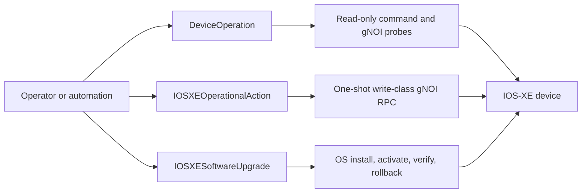
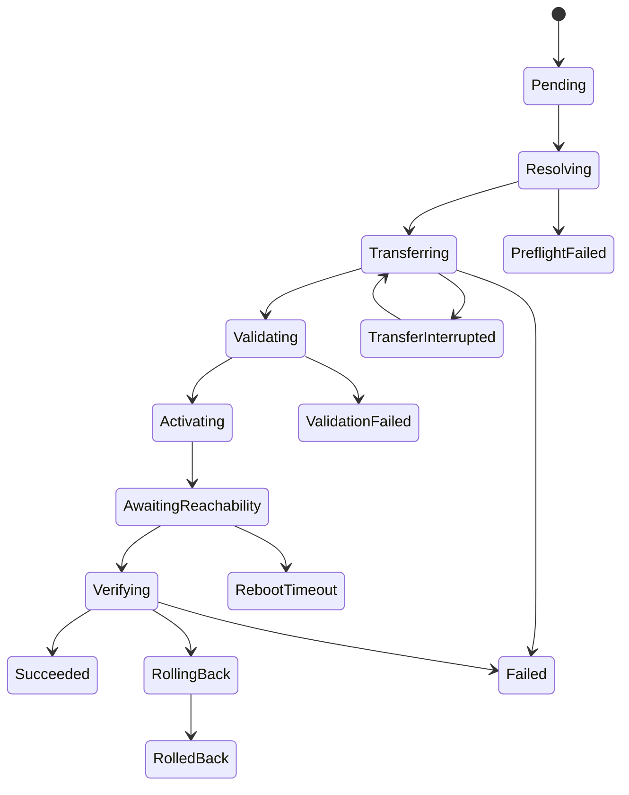

# DeviceOperation

`DeviceOperation` is the sibling-CRD path for auditable, asynchronous, non-Pod operations.



```yaml
apiVersion: ops.cisco.vk/v1alpha1
kind: DeviceOperation
metadata:
  name: show-version
spec:
  deviceRef:
    name: cat9k-smoke
  operation:
    kind: ShowCommand
    commands:
      - show version
  ttlSecondsAfterFinished: 300
```

## Supported Read-Only Kinds

`ShowCommand` runs one or more read-only IOS-XE commands through the same allowlist used by `IOSXEDiagnostic`.

`ConfigDiff` captures `show running-config`. If `operation.args.baseline` is provided, status output contains a compact line diff between the baseline and observed running configuration.

Restrict `ConfigDiff` to specific namespaces via the per-device CR:

```yaml
apiVersion: cisco.vk/v1alpha1
kind: CiscoDevice
metadata: {name: cat9k-smoke}
spec:
  driver: XE
  address: 10.1.1.1
  opsPolicy:
    configDiffAllowedNamespaces: ["ops", "tenant-a"]
```

The CiscoDevice controller renders `spec.opsPolicy.configDiffAllowedNamespaces`
as `CVK_OPS_CONFIGDIFF_ALLOWED_NAMESPACES` (comma-separated) on the per-device
VK pod. Requests from other namespaces fail with `Ready=False,
reason=NamespaceNotAuthorized`. An empty/absent list preserves the
unrestricted default. The CRD spec is the authoritative source — imperative
`kubectl set env` edits get reverted on the next reconcile.

`PacketCapture` reads an existing IOS-XE monitor capture buffer. Provide either `operation.args.name`/`capture`, which expands to `show monitor capture <name> buffer dump`, or an explicit allowlisted `operation.args.command`.

Packet-capture output larger than 256 KiB is written to a ConfigMap named
`<deviceoperation-name>-output` in the same namespace. The status keeps a
truncated preview in `.status.outputs[].output` and records
`.status.artifactURIs[]` as `configmap://<namespace>/<name>/<key>`, for example
`configmap://default/capture-output/output`. Captures larger than 900 KiB are
rejected with `Ready=False, reason=ArtifactTooLarge`.

Read-only gNOI kinds use the same CRD/status machinery:

| Kind | gNOI service | Typical use |
|---|---|---|
| `GNOIPing` | System | Reachability probe from the device. |
| `GNOITraceroute` | System | Hop-by-hop path check from the device. |
| `GNOITime` | System | Device clock check. |
| `GNOIFileGet` | File | Read a bounded file preview or spill to ConfigMap. |
| `GNOIFileStat` | File | Validate staged files and metadata. |
| `GNOICertGet` | Cert | List installed certificates. |
| `GNOICanGenerateCSR` | Cert | Check CSR capability for a key/certificate profile. |
| `GNOIRebootStatus` | System | Inspect pending or active reboot state. |
| `GNOIOSVerify` | OS | Verify the current running version and activation state. |

Example status:

```bash
$ kubectl get devop
NAME                  DEVICE       KIND          PHASE       AGE
show-version          cat9k-smoke  ShowCommand   Succeeded   2m
flash-stat            cat9k-smoke  GNOIFileStat  Succeeded   45s

$ kubectl get devop flash-stat -o jsonpath='{.status.outputs[0].output}'
path=flash:cat9k_iosxe.17.18.02.SPA.bin size=1264332800
```

Write-class gNOI operations are implemented as a separate
`IOSXEOperationalAction` CRD. They are disabled unless the per-device VK is
started with `--enable-write-class-gnoi` / `CISCO_VK_ENABLE_WRITE_CLASS_GNOI`.
Keep the flag off for read-only DeviceOperation deployments.

## Implementation Boundary

The v1alpha1 controller intentionally keeps the three read-only kinds in one
small reconciler because they share the same validation, transport, redaction,
inline output, TTL, and status machinery.

Write-class operations intentionally do not reuse this reconciler. They are
handled by `IOSXEOperationalAction`, which has its own RBAC, finalizer,
confirmation guard, invocation ID, Kubernetes events, and one-shot dispatch
rules.

## Write-Class Actions

`IOSXEOperationalAction` supports:

- `Reboot`
- `CancelReboot`
- `KillProcess`
- `FilePut`
- `FileRemove`
- `FactoryReset`

Every action targets exactly one `CiscoDevice` and must set
`spec.confirm` to the target device name. The spec is immutable after create,
and the action request must contain exactly the args block matching
`spec.action.kind`.

Example reboot:

```yaml
apiVersion: ops.cisco.vk/v1alpha1
kind: IOSXEOperationalAction
metadata:
  name: reload-cat9k-smoke
spec:
  deviceRef:
    name: cat9k-smoke
  confirm: cat9k-smoke
  action:
    kind: Reboot
    reboot:
      method: COLD
      delaySeconds: 0
      message: "maintenance reload"
```

```bash
$ kubectl get xeop
NAME                 DEVICE       KIND     PHASE       AGE
reload-cat9k-smoke   cat9k-smoke  Reboot   Succeeded   7m

$ kubectl get events --field-selector involvedObject.name=reload-cat9k-smoke
LAST SEEN   TYPE     REASON      OBJECT                                      MESSAGE
7m          Normal   Running     iosxeoperationalaction/reload-cat9k-smoke   Reboot dispatched for cat9k-smoke
6m          Normal   Succeeded   iosxeoperationalaction/reload-cat9k-smoke   Reboot completed for cat9k-smoke
```

Lifecycle:

- `Pending` action CRs are validated and marked `Running` before the gNOI RPC
  is dispatched.
- A `Running` action is never dispatched a second time. If the controller dies
  after the device-side invocation, operators must create a new CR to retry.
- Terminal phases are `Succeeded`, `Failed`, and `Rejected`.
- The finalizer is retained while an invocation is in progress so a delete
  request cannot erase the audit trail before completion.
- Normal events are emitted for `Running` and `Succeeded`; Warning events are
  emitted for `Rejected`, `Failed`, and delete-pending audit preservation.

`FactoryReset` should be enabled last in any rollout. Prefer namespace-scoped
RBAC for the operators allowed to create these CRs, and keep read-only
`DeviceOperation` RBAC separate from write-class action RBAC.

## Software Upgrades

`IOSXESoftwareUpgrade` drives the gNOI OS install, activate, reachability, and
verify flow. It is disabled unless the per-device VK is started with
`--enable-iosxesoftwareupgrade` /
`CISCO_VK_ENABLE_IOSXE_SOFTWARE_UPGRADE`.

Use exactly one image source:

- `url` plus `sha256`
- `configMapRef`
- `localPath`

For `localPath`, use `localPathSHA256` when the device supports gNOI File.Get
hash reporting. Without that field, CVK can activate a staged image but cannot
verify the local flash file before activation.

If `rollbackOnFailure` is true and post-activation verification reports a
different running version than the requested target, the reconciler enters
`RollingBack`, re-activates the previously observed running version, and
terminates as `RolledBack` once `OS.Verify` confirms that version.



```bash
$ kubectl get xeupgrade
NAME                    DEVICE       TARGET     PHASE                 AGE
cat9k-smoke-to-17-18    cat9k-smoke  17.18.02   AwaitingReachability  28m

$ kubectl describe xeupgrade cat9k-smoke-to-17-18 | sed -n '/Conditions:/,/Events:/p'
Conditions:
  Type              Status  Reason
  ImageResolved     True    LocalPathVerified
  Transferred       True    StagedImagePresent
  Validated         True    OSInstallValidated
  Activated         True    ActivationMayHaveStarted
  DeviceReachable   False   WaitingForGNXI
```

## RBAC

The per-device VK service account watches `DeviceOperation` in order to run
operations targeting its device. It has `create` on the main resource only so
the localhost admin endpoint can synthesize transient operations, and `delete`
only for `ttlSecondsAfterFinished` cleanup. Operation results are written
through `deviceoperations/status`.

Operators who create `DeviceOperation` objects directly should receive their
own namespace-scoped RBAC. Write-class actions and software upgrades use
separate CRDs and should receive separate RBAC grants.

## Admin Exec Wrapper

The localhost admin endpoint `POST /v1/exec` now creates a transient `DeviceOperation` and polls status when the in-pod controller client is available. This preserves the existing plugin shape while routing execution through the CRD audit path.

## Status

Results are written to `.status.outputs[]`; large packet captures may also set
`.status.artifactURIs[]`. Terminal phase is one of `Succeeded`, `Failed`, or
`Cancelled`. `ttlSecondsAfterFinished` requests best-effort cleanup after
completion.

## Roadmap Gates

The following items are deliberately outside the current read-only v1alpha1
surface:

- Tenant ownership/admission checks before promoting write-class CRDs beyond
  tightly controlled namespaces.
- Conversion webhook scaffolding before promotion beyond `v1alpha1`.
- External artifact sinks beyond the in-namespace ConfigMap backing for large
  packet-capture output.
- Cross-device or multi-supervisor rollback policy beyond re-activating the
  previously observed single-device version.
