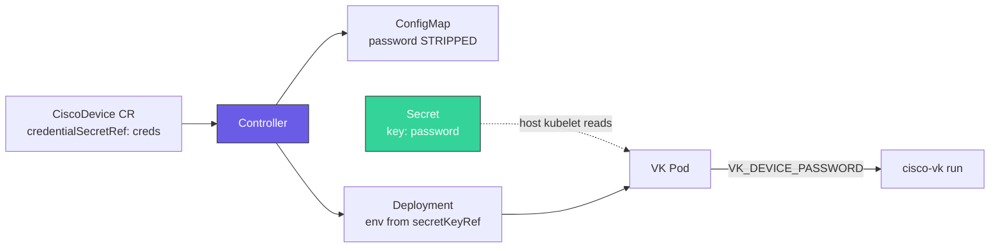

# Security

This page covers credential handling, TLS configuration, and the RBAC model.

## Credential injection

Device credentials **never** reach etcd in plaintext. The controller enforces this at two layers:

1. Before the `DeviceSpec` is marshalled into the ConfigMap, both `password` and `credentialSecretRef` are stripped.
2. The VK pod's Deployment gets `VK_DEVICE_PASSWORD` as an environment variable sourced from a Secret via `valueFrom.secretKeyRef`. The controller itself never reads the Secret.



### Recommended: Secret + `credentialSecretRef`

```yaml
apiVersion: v1
kind: Secret
metadata:
  name: cat9000-1-creds
  namespace: default
type: Opaque
stringData:
  password: <device-password>
```

```yaml
apiVersion: cisco.vk/v1alpha1
kind: CiscoDevice
metadata:
  name: cat9000-1
  namespace: default
spec:
  driver: XE
  address: "192.168.1.100"
  username: admin
  credentialSecretRef:
    name: cat9000-1-creds
  # ... remaining spec
```

**Rules:**

- The Secret **must be in the same namespace** as the `CiscoDevice`.
- The Secret key **must be named `password`** — this is hardcoded in the controller.
- Any Secret type works (`Opaque`, `kubernetes.io/basic-auth`, …) as long as it has a `password` key.
- Multiple `CiscoDevice`s can point at different Secrets — credentials are per-device.

### Legacy fallback: inline password

If `credentialSecretRef` is not set **and** `password` is non-empty, the controller injects it directly as an env var value (still scrubbed from the ConfigMap):

```yaml
spec:
  password: cisco123   # discouraged — only for dev/test
```

This remains for backward compatibility. The password is still visible in the `Deployment` spec (`kubectl get deploy -o yaml`), so Secret refs are strongly preferred in production.

### VK_DEVICE_PASSWORD precedence

The VK pod reads the device password from the `VK_DEVICE_PASSWORD` environment variable, which the controller injects on the Deployment it creates (sourced from the Secret referenced by `credentialSecretRef`). The password field in the rendered ConfigMap is always empty — the env var is the sole source of truth inside the pod.

### Rotating a single password

To rotate a device password without recreating the `CiscoDevice`:

```bash
# 1. Change the password on the device
# 2. Update the Secret
kubectl patch secret cat9000-1-creds --type merge \
  -p '{"stringData":{"password":"new-password"}}'
# 3. Restart the VK pod so it picks up the new env var
kubectl -n default rollout restart deploy/cat9000-1-vk
```

The controller sets a `cisco.vk/config-hash` annotation on the pod template that only changes when the ConfigMap changes, so Secret-only rotations do not auto-restart the pod. Use an explicit `rollout restart`. See [Managing credentials across multiple devices → Bulk rotation](#bulk-rotation) for fleet-wide workflows.

### Managing credentials across multiple devices

Each `CiscoDevice` is independent: it declares its own `username` inline in the spec and points at its own Secret for the password. That means any combination of shared or distinct credentials is supported.

#### Pattern 1 — one Secret per device (different credentials)

The safest default. Every device gets its own Secret, even if the credentials happen to match today. A compromised or rotated password affects only one device.

```yaml
apiVersion: v1
kind: Secret
metadata:
  name: cat9000-edge-01-creds
  namespace: edge
stringData:
  password: <unique-password-1>
---
apiVersion: v1
kind: Secret
metadata:
  name: cat9000-edge-02-creds
  namespace: edge
stringData:
  password: <unique-password-2>
---
apiVersion: cisco.vk/v1alpha1
kind: CiscoDevice
metadata:
  name: cat9000-edge-01
  namespace: edge
spec:
  username: admin-edge-01
  credentialSecretRef:
    name: cat9000-edge-01-creds
  # ...
---
apiVersion: cisco.vk/v1alpha1
kind: CiscoDevice
metadata:
  name: cat9000-edge-02
  namespace: edge
spec:
  username: admin-edge-02
  credentialSecretRef:
    name: cat9000-edge-02-creds
  # ...
```

Rotate one device's password without touching any other.

#### Pattern 2 — shared Secret across a fleet (identical credentials)

When a group of devices share credentials (for example, lab devices behind the same TACACS/AAA profile), a single Secret can serve all of them. Each `CiscoDevice` references the same `credentialSecretRef`.

```yaml
apiVersion: v1
kind: Secret
metadata:
  name: lab-fleet-creds
  namespace: lab
stringData:
  password: <shared-password>
---
apiVersion: cisco.vk/v1alpha1
kind: CiscoDevice
metadata:
  name: lab-cat8kv-01
  namespace: lab
spec:
  username: admin       # same username across the fleet
  credentialSecretRef:
    name: lab-fleet-creds
  # ...
---
apiVersion: cisco.vk/v1alpha1
kind: CiscoDevice
metadata:
  name: lab-cat8kv-02
  namespace: lab
spec:
  username: admin
  credentialSecretRef:
    name: lab-fleet-creds   # same Secret as above
  # ...
```

Useful for bulk rotation — one Secret patch propagates to every device that references it. Trade-off: a compromised password affects the whole fleet.

#### Pattern 3 — same password, different usernames

Username is in the spec, not the Secret, so devices can share a password Secret while declaring different usernames.

```yaml
apiVersion: cisco.vk/v1alpha1
kind: CiscoDevice
metadata: { name: dev-01, namespace: dev }
spec:
  username: operator-a
  credentialSecretRef: { name: shared-creds }
---
apiVersion: cisco.vk/v1alpha1
kind: CiscoDevice
metadata: { name: dev-02, namespace: dev }
spec:
  username: operator-b
  credentialSecretRef: { name: shared-creds }
```

#### Namespace boundaries

The Secret **must be in the same namespace** as the `CiscoDevice`. Kubernetes' own kubelet (on the real cluster node hosting the VK pod) resolves `secretKeyRef` at pod-start time; the controller has no mechanism to read cross-namespace Secrets.

Use this as a security boundary — a team owning `namespace=edge-team-a` cannot read Secrets in `namespace=edge-team-b`, so their CiscoDevices cannot reference the other team's credentials even by name.

If you want the same password in two namespaces, duplicate the Secret (ideally managed by External Secrets Operator, Sealed Secrets, or your GitOps tooling).

#### Bulk rotation

| Scenario | Approach |
|---|---|
| Rotate one device | `kubectl patch secret <name> --type merge -p '{"stringData":{"password":"<new>"}}'` → `kubectl rollout restart deploy/<device>-vk` |
| Rotate a shared Secret (Pattern 2) | Same patch — then `kubectl rollout restart` every Deployment that references it (loop on label selector) |
| Rotate the whole namespace | Update all Secrets, then `kubectl rollout restart deploy -n <ns> -l app.kubernetes.io/name=cisco-vk` |

The controller's `cisco.vk/config-hash` annotation only changes when the **ConfigMap** changes. Secret-only updates never trigger a pod rollout on their own — an explicit rollout restart is required for the env var to be re-read.

#### GitOps and external secret managers

The `credentialSecretRef` field takes a reference to any Kubernetes `Secret`, regardless of how it was created. Common workflows:

- **Sealed Secrets** — commit encrypted Secrets to Git; controller in the cluster decrypts them into real Secrets.
- **External Secrets Operator** — point at HashiCorp Vault, AWS Secrets Manager, Azure Key Vault, GCP Secret Manager, etc.; ESO syncs them into Kubernetes Secrets.
- **SOPS / git-crypt** — encrypted manifests in Git, decrypted on apply.

All of these produce a normal `Secret` resource with a `password` key, which is what `credentialSecretRef` needs. No change to CiscoDevice is required.

## TLS

Device-side TLS is configured under `spec.tls`:

```yaml
spec:
  tls:
    enabled: true
    insecureSkipVerify: false
    caFile: /etc/ssl/certs/corp-ca.crt
    certFile: /etc/ssl/cvk/client.crt
    keyFile: /etc/ssl/cvk/client.key
```

| Field | Notes |
|---|---|
| `enabled` | Turn on HTTPS. Required in production. |
| `insecureSkipVerify` | `true` disables certificate verification. Acceptable for lab devices with self-signed certs; **do not** use in production. |
| `caFile` | Trust anchor for verifying the device certificate. |
| `certFile`, `keyFile` | Optional client certificate — required only if the device enforces mutual TLS. |

The `certFile` / `keyFile` / `caFile` paths refer to files **inside the VK pod**. Mount them with a Secret-backed volume or a configMap-backed volume on the VK Deployment. The controller does not currently auto-mount them — you'll need a post-install patch or a forked chart.

### Kubelet-side TLS

The VK runs its own HTTPS listener on `:10250` (serving the kubelet API surface). By default it auto-generates a self-signed cert on every start into `/var/lib/virtual-kubelet/`. Override with:

```
--tls-cert-file /etc/kubelet/tls.crt
--tls-key-file  /etc/kubelet/tls.key
```

On k3s clusters that reject self-signed kubelet certs, set `kubelet-certificate-authority=""` in `/etc/rancher/k3s/config.yaml` to accept them — this is required for `kubectl logs` / `kubectl top` against the VK node.

## RBAC model

The Helm chart creates two service accounts with scoped ClusterRoles.

### Controller service account (`cisco-virtual-kubelet-controller`)

Used by the `manager` pod. Permissions (from kubebuilder markers):

| Resource | Verbs | Scope |
|---|---|---|
| `cisco.vk/ciscodevices` | get, list, watch, update, patch | cluster |
| `cisco.vk/ciscodevices/status` | get, update, patch | cluster |
| `configmaps` | get, list, watch, create, update, patch, delete | cluster |
| `deployments` (`apps`) | get, list, watch, create, update, patch, delete | cluster |
| `nodes` | get, list, watch, delete | cluster |

The controller **never** needs `secrets` permission — it references Secrets but does not read them. Kubernetes' own kubelet (on the real cluster node where the VK pod runs) resolves the Secret at pod-start time.

### VK pod service account (`cisco-virtual-kubelet`)

Used by each VK pod. Permissions:

| Resource | Verbs | Rationale |
|---|---|---|
| `pods`, `pods/status`, `pods/logs`, `pods/exec` | get, list, watch, create, update, patch, delete | VK provider API |
| `nodes`, `nodes/status` | get, list, watch, create, update, patch, delete | Register and update the virtual node |
| `configmaps`, `secrets` | get, list, watch | Read-only for pod volume mounts |
| `services` | get, list, watch | Service discovery surface for pods |
| `persistentvolumes`, `persistentvolumeclaims` | get, list, watch | Not used directly today; reserved for future volume support |
| `events` | create, patch | Emit pod lifecycle events |
| `leases` (in `kube-node-lease`) | get, list, watch, create, update, patch, delete | Node heartbeat via Lease API |

### Finalizer and deletion

The controller adds the finalizer `cisco.vk/device-cleanup` to every `CiscoDevice`. On deletion:

1. Controller observes `DeletionTimestamp`.
2. Deletes the virtual `Node` (cluster-scoped — not cascade-deleted with the CR).
3. Removes the finalizer.
4. Kubernetes cascade-deletes the owned `ConfigMap` and `Deployment`.

This is the only path that removes the virtual node cleanly — do not delete the `CiscoDevice` by force (`--force --grace-period=0`) or you will leak the node.

## Principles

- **Credentials never land in etcd in plaintext.** They live in Secrets, which are at rest encrypted when the cluster has encryption-at-rest configured.
- **Minimum privilege on the controller.** The controller holds no `secrets` permission. Reading them is delegated to the kubelet at pod-start time.
- **Per-device credentials.** Each `CiscoDevice` can reference a different Secret.
- **Finalizer-managed cleanup.** Cluster-scoped resources owned by namespaced CRs are cleaned up explicitly.

## Related reading

- [Configuration → Core](CONFIGURATION.md#core) — `password` and `credentialSecretRef` fields
- [Architecture → Controller reconciliation](ARCHITECTURE.md#controller-reconciliation) — the flow from CR to deployed pod
- [Getting Started](getting-started.md) — end-to-end first deployment with a Secret
